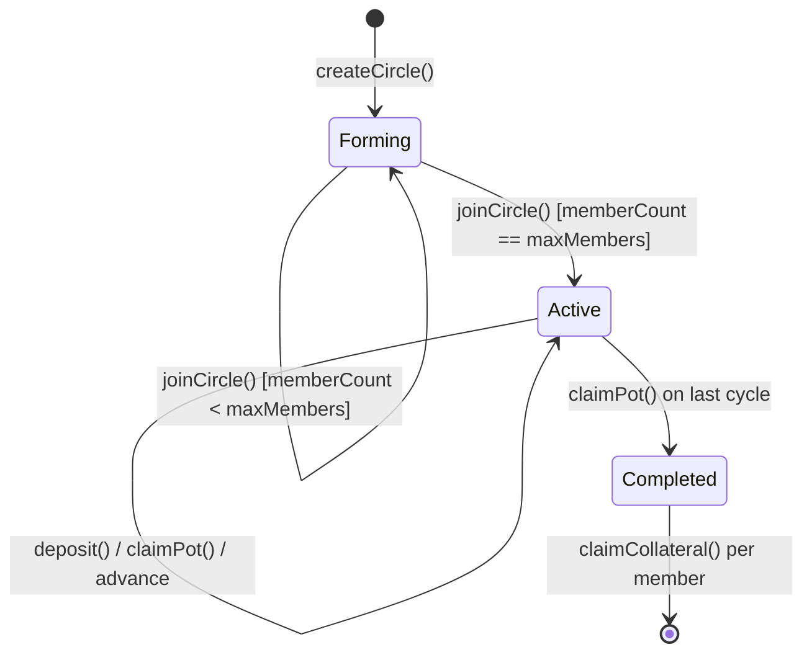
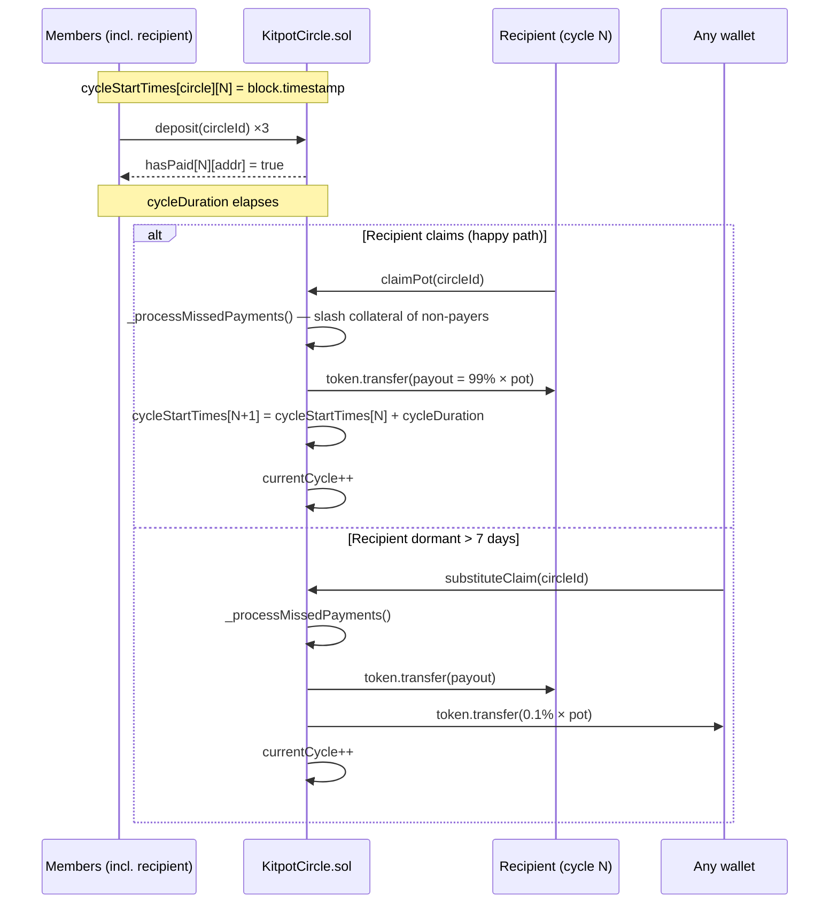

## Initia Hackathon Submission

- **Project Name**: Kitpot

### Project Overview

Kitpot is a trustless rotating savings circle (ROSCA / arisan / chit fund) built on its own Initia EVM rollup — for the 300M+ people worldwide who already pool money with friends every cycle to take turns receiving the pot, but currently rely on a centuries-old single point of trust failure: a treasurer who could disappear with the money. Kitpot replaces the treasurer with a smart contract: deposit collection, late-payment penalties, pot distribution, and dormant-recipient safety nets are all executable on-chain code. The user-facing UX feels like "tap pay → done" because of Initia's native auto-signing, so the digital experience matches the off-chain ritual it ports.

### Implementation Detail

- **The Custom Implementation**: A 5-contract Solidity protocol on Foundry. `KitpotCircle.sol` is the core ROSCA engine with multi-token support (any ERC20 — circles can be USDC, USDe, or any future bridged stable), configurable cycle duration / member count / late penalty, on-chain late-payment slashing from collateral, and a pull-claim model where the recipient calls `claimPot()` themselves with a permissionless `substituteClaim()` safety net that any wallet can fire after a 7-day dormant grace (caller earns 0.1% as a keeper fee, pot still goes to the recipient). `KitpotReputation.sol` tracks XP + tiers (Bronze → Diamond) + daily quest streaks. `KitpotAchievements.sol` mints soulbound ERC721 badges with on-chain SVG metadata (no IPFS). 102 Foundry tests pass across PullClaim, SubstituteClaim, TimeDeterminism, ConfigValidation, KitpotCircle, and KitpotReputation suites.

- **The Native Feature**: Three Initia-native features are integrated meaningfully:
  - **Auto-signing** (Cosmos `x/authz` + `x/feegrant` via InterwovenKit `autoSign.enable` + `submitTxBlock`) — once a member enables auto-sign on the kitpot-2 chain, all `MsgCall`-wrapped contract writes during that session sign silently by a derived ghost wallet. No popup per cycle deposit. **Honest scope:** this is a session-based primitive — when the user closes the tab the ghost wallet key disappears. It is not a server-side bot; it removes friction during interactive use, not while the user is asleep.
  - **`.init` Usernames** (`useUsernameQuery`) — every member identity in the UI (turn order, payment status, leaderboard, profile) is resolved through Initia's L1 username registry. If the wallet has no `.init` registered, we fall back honestly to a truncated address — never fake `.init`-shaped strings.
  - **Interwoven Bridge** (`openDeposit` + `openWithdraw`) — bidirectional bridge UI on the Faucet page, pre-filled with `initiation-2` ↔ `kitpot-2` for native `uinit`. **Honest scope:** because `kitpot-2` is not yet registered in Initia's public chain registry, the bridge modal currently returns "No available assets" for fresh wallets. We document this in-product per the official Initia hackathon docs guidance and ship the integration so judges can verify the InterwovenKit bridge flow opens correctly with our chain pre-selected.

### How to Run Locally

```bash
# 1. Clone + install
git clone https://github.com/viandwi24/kitpot && cd kitpot
bun install

# 2. Configure frontend env (point at our public testnet)
cp apps/web/.env.example apps/web/.env.local
# Defaults already target https://kitpot-rpc.viandwi24.com — no edit needed
# unless you want to spin up a local rollup via `weave init` first.

# 3. Start the frontend
cd apps/web && bun dev
# Open http://localhost:3000, click Connect Wallet → Privy Google login

# 4. (Optional) Run contract tests
cd ../contracts && forge test -vv
```

Or skip steps 1–3 entirely and use the live deployment at <https://kitpot.vercel.app> — the auto-faucet on first connect drips GAS + 5,000 USDC + 5,000 USDe so you can immediately create or join a circle.

---

# Kitpot — Trustless Savings Circles on Initia

> The 500-year-old social savings ritual, on-chain, with the treasurer replaced by a smart contract.

| | |
|---|---|
| **Live demo** | <https://kitpot.vercel.app> |
| **Demo video** | _to be added_ |
| **Track** | Gaming & Consumer |
| **Rollup chain ID** | `kitpot-2` (EVM 64146729809684) |
| **Hackathon** | INITIATE: The Initia Hackathon |

---

## The problem

Rotating savings circles are how 300+ million people on the planet save money. They go by many names depending on where you grew up:

| Name | Region |
|---|---|
| Arisan | Indonesia |
| Chit Fund | India |
| Hui | China |
| Tanda | Mexico |
| Tontine | West Africa |
| Paluwagan | Philippines |
| Susu | Caribbean |
| Cundina | Latin America |

The shape is identical everywhere: a closed group commits to contribute the same amount each cycle (weekly / monthly), and one member at a time receives the total pot. After every member has had a turn, the cycle ends. It's effectively a peer-to-peer interest-free loan and forced-savings tool combined.

The centuries-old failure mode is also the same everywhere: **someone has to hold the money between contributions and payouts**. That someone can disappear with the pot, miscount, play favorites, or just stop responding to messages. Rotating savings circles run on social trust, and social trust scales badly past your immediate friend group.

## The solution — meet Kitpot

Kitpot is a rotating savings circle where the treasurer is a smart contract. Every member deposits the same contribution into the contract each cycle; the contract picks the recipient based on round-robin order and pushes the pot to them when the cycle window elapses. Collateral the user posts on join is held by the contract and slashed on missed payments, so the late-payment problem (which IRL ROSCAs handle with shouting and broken friendships) is enforced atomically.

The interesting part is not the contract math — chit-fund mechanics are well understood. The interesting part is making the on-chain version feel like the off-chain version: tap pay → done, no approval popup per month. We solve that with Initia's native auto-signing primitive: a one-time grant lets the user pay every cycle silently for the rest of their session.

## How it works (90 seconds)

```
1.  CREATE   — Anyone creates a circle. Set token (USDC / USDe / any ERC20),
              contribution amount, member count (3–20), cycle duration
              (60 s for demo, days/weeks/months for real circles), grace period,
              late penalty %, public/private, optional minimum trust tier.

2.  JOIN     — Other members open the share link (/join/<id>) and deposit
              1× contribution as collateral. When the last seat fills, the
              circle status flips Forming → Active and cycle 0 starts.

3.  AUTO-SIGN — Each member enables auto-sign once (single header click,
              one Privy/Brave popup to sign the authz + feegrant message).
              From that moment on, deposits + claims this session sign silently.

4.  DEPOSIT  — Within each cycle window, every member calls deposit().
              Late deposits past grace period: 5% of contribution slashed
              from collateral.

5.  CLAIM    — Once the cycle elapses, the cycle's recipient calls
              claimPot(), which atomically: slashes collateral of any member
              who didn't deposit, transfers (totalPot − 1% platform fee) to
              the recipient, advances the circle to the next cycle.

6.  KEEPER   — If the recipient is dormant for 7 more days,
              substituteClaim() unlocks for the public. Anyone can call it;
              the pot still lands at the recipient's wallet, the keeper
              earns 0.1% of the pot as a fee for unsticking the circle.

7.  COMPLETE — When every member has been the recipient once, status →
              Completed. Each member calls claimCollateral() to get their
              initial deposit back (minus any late-payment slashes).
```

## Architecture

### System layout

```mermaid
graph LR
  subgraph Browser
    UI[Next.js 16 + React 19<br/>kitpot.vercel.app]
    IK[InterwovenKit<br/>@initia/interwovenkit-react]
    PR[Privy<br/>Google / email login]
  end

  subgraph Vercel
    API[/api/gas-faucet<br/>auto-mints GAS + USDC + USDe<br/>via @initia/initia.js + viem/]
  end

  subgraph "Initia L1 (initiation-2)"
    L1Reg[.init Username Registry]
    Authz[x/authz + x/feegrant<br/>auto-sign grants]
  end

  subgraph "Kitpot rollup (kitpot-2)"
    Node[minitiad<br/>MiniEVM rollup node]
    KC[KitpotCircle.sol<br/>ROSCA engine + pull-claim]
    KR[KitpotReputation.sol<br/>XP / tier / streak]
    KA[KitpotAchievements.sol<br/>soulbound ERC721, on-chain SVG]
    USDC[MockUSDC]
    USDe[MockUSDe]
  end

  PR --> IK
  UI --> IK
  IK -->|requestTxBlock / submitTxBlock<br/>MsgCall envelope| Node
  IK -->|useUsernameQuery| L1Reg
  IK -->|autoSign.enable| Authz
  UI --> API
  API -->|MsgSend GAS| Node
  API -->|EVM mint| USDC
  API -->|EVM mint| USDe
  KC -->|writes XP / payments| KR
  KC -->|mints badges| KA
  KC -->|safeTransferFrom| USDC
  KC -->|safeTransferFrom| USDe
```

### Circle lifecycle



### One cycle in detail (pull-claim model)



The next cycle's deadline is computed as `prevStart + cycleDuration`, **not** `block.timestamp` of the claim. A claim that lands 6 days late does not extend the next cycle by 6 days — depositors can predict every deadline at circle creation time.

### Auto-sign session

```mermaid
sequenceDiagram
  participant U as User browser
  participant IK as InterwovenKit SDK
  participant L1 as Initia L1 (authz + feegrant modules)
  participant K as kitpot-2 rollup

  U->>IK: autoSign.enable("kitpot-2")
  IK->>U: derive ghost wallet from user signature
  IK->>U: sign authz grant + feegrant grant
  U->>L1: broadcast MsgGrantAllowance + MsgGrant
  L1-->>IK: indexed (≈60 s on single-validator testnet)
  IK->>U: toggle "Auto-sign ON"
  loop For each subsequent tx this session
    U->>IK: deposit() / claimPot() / approveToken()
    IK->>K: submitTxBlock — ghost wallet signs MsgExec wrapping MsgCall
    K-->>U: receipt — no popup
  end
  Note over U,IK: Closing the tab deletes the ghost key.<br/>Session ends; next visit needs another enable.
```

## What's intentionally NOT shipped (honest scope)

- **Background auto-pay (server-side bot).** Auto-sign as integrated is browser-bound. Shipping a server bot that holds long-lived authz grants from users is a real engineering problem (key custody, monitoring, cost) that we do not solve in this submission. It is on the roadmap below.
- **OPinit executor + IBC relayer running on our public deployment.** Our `infra/dokploy/entrypoint.sh` contains the bot setup but ships with `RUN_OPINIT=false` because each bot needs an L1-funded mnemonic and active monitoring. Bridge UI is integrated and the kitpot-2 chain is bridge-ready architecturally; making the L1↔rollup transport actually carry assets requires enabling those bots and registering kitpot-2 in the Initia chain registry. This is documented openly in `/about` and in the Faucet page Bridge card.
- **Telegram mini-app.** A reference ROSCA on a different chain (CrediKye on Creditcoin) ships a Grammy-based Telegram surface for notifications and lightweight UX. We did not build this in the hackathon window. See vision below.
- **Mainnet deployment.** Everything below is on Initia testnet. Our smart contracts are not audited.

These are conscious tradeoffs, not bugs. We chose to focus the time budget on what would directly demonstrate Initia-native integration depth: all three native features, multi-token circles, pull-claim + permissionless keeper, and an honest live demo.

## Business model

| Stream | Mechanism | Status |
|---|---|---|
| Platform fee | 1% of every pot, kept in `accumulatedFees[token]`, owner-withdrawable | Live, configurable up to 5% in `KitpotCircle.sol` |
| Late-payment penalties | 5% of contribution slashed from collateral on missed cycles, deposited into the same fee pool | Live, configurable per-circle |
| Keeper fee | 0.1% of pot to whoever calls `substituteClaim` after dormant grace | Live (plan 22) |
| Premium circles (planned) | Higher contribution caps, custom branding, off-chain reminders, higher trust tiers required | Roadmap |
| Reputation-as-a-service (planned) | Other Initia dapps could read `KitpotReputation` to gate access to higher-risk loans, NFT mints, governance | Roadmap |

The fee model is symmetric to traditional ROSCA management fees (5–10% in many countries). At 1% we sit well below that — sustainable but not extractive.

## Market

- **300 M+** people globally participate in rotating savings circles, per World Bank Findex data.
- **$50 B+/year** of informal savings flows through arisan/chit funds in Indonesia alone, by central bank estimate.
- The product fits markets where: (a) banking penetration is uneven, (b) trust networks are tight (diaspora, religious / cultural communities, workplace teams), and (c) social punishment for breaking ROSCAs is high — meaning user retention curves on a digital ROSCA can resemble messaging apps more than savings apps.
- The **first wedge** is diaspora communities already organising arisan over WhatsApp groups — they have the social fabric but bleed pots regularly to disappearing treasurers.

We are not pitching a "DeFi yield" product. The promise to users is "the savings circle you already do, with the treasurer replaced by code".

## Competitive landscape

| | Kitpot | CrediKye (Creditcoin) | Generic crypto wallet |
|---|---|---|---|
| Initia-native auto-sign | ✅ | ❌ | ❌ |
| Initia `.init` username registry | ✅ | ❌ | ❌ |
| Interwoven Bridge UI | ✅ (bidirectional) | ❌ | ❌ |
| Multi-token circles | ✅ USDC + USDe + extensible | ❌ single token | n/a |
| On-chain late penalty | ✅ collateral slash | ⚠️ off-chain points only | n/a |
| Pull-claim + permissionless keeper safety net | ✅ | ❌ | n/a |
| Telegram mini-app | ❌ (roadmap) | ✅ Grammy bot | n/a |
| Soulbound NFT badges | ✅ on-chain SVG | ✅ | n/a |
| Own appchain | ✅ kitpot-2 rollup via minitiad | n/a (Creditcoin) | n/a |

The closest direct comparison (CrediKye) is on a different chain (Creditcoin) so we are not literally competing for the same INITIATE prize, but it is the most honest mirror of the product surface. Our advantage is depth of Initia integration; their advantage is mobile distribution. Both are correct strategies for their respective ecosystems.

## Roadmap (post-hackathon)

| Order | Item | Why |
|---|---|---|
| 1 | Telegram mini-app + Grammy bot | Notifications when it's your turn to claim, your turn to deposit, or the cycle is about to penalty-slash you. Lifts the pull-claim model from "user must check the dashboard" to "user gets nudged on the channel they actually live on". Detailed in `docs/plans/22-pull-claim-keeper.md` §9. |
| 2 | Enable OPinit executor + challenger + IBC relayer on public deployment | Makes Bridge actually carry `uinit` between L1 and kitpot-2. Requires funded mnemonics, monitoring, restart automation. |
| 3 | Register kitpot-2 in Initia public chain registry | PR to `initia-labs/initia-registry`. Enables `scan.testnet.initia.xyz/kitpot-2`, makes our chain show up in the InterwovenKit bridge modal as a real destination. |
| 4 | Server-side authz bot for offline auto-pay | Optional second auto-sign mode where the user grants a Kitpot-operated bot wallet `MsgExec` permission scoped to a single circle's deposit calls. Pays cycles even when the user is offline. Custody and key rotation become real concerns; we treat this as a proper product step, not a hackathon hack. |
| 5 | Real bridged stables (Noble USDC, etc.) as circle tokens | Drop the MockUSDC / MockUSDe pair in favor of real bridged-in stables. Contract is already token-agnostic, so it's an env + frontend change, not a contract change. |
| 6 | Reputation-as-a-service SDK | Let other Initia dapps query `KitpotReputation` to gate feature access by trust tier. |

## Live program details

### Endpoints

| Surface | URL |
|---|---|
| App | <https://kitpot.vercel.app> |
| Program overview (live status) | <https://kitpot.vercel.app/about> |
| EVM JSON-RPC | <https://kitpot-rpc.viandwi24.com> |
| Cosmos RPC | <https://kitpot-cosmos.viandwi24.com> |
| Cosmos REST | <https://kitpot-rest.viandwi24.com> |
| Initia L1 RPC (bridge source) | <https://rpc.testnet.initia.xyz> |
| Initia L1 faucet | <https://faucet.testnet.initia.xyz> |

### Chain identity

| Field | Value |
|---|---|
| Cosmos chain ID | `kitpot-2` |
| EVM chain ID (decimal) | `64146729809684` |
| EVM chain ID (hex) | `0x3a57530b3714` |
| Native token | `GAS` (18 decimals) |
| Bech32 prefix | `init` |
| Block production | single sequencer, ~10–15 s blocks (testnet) |

### Contract addresses (kitpot-2 rollup, plan 22 redeploy)

| Contract | Address | Purpose |
|---|---|---|
| `KitpotCircle` | `0x7526CE9959756Fb5fc5e4431999A2660eEd8cD86` | Core ROSCA engine; pull-claim + substituteClaim live |
| `MockUSDC` | `0xa157C9fB56A2929D30d5EBe9442Ab669D5943Df1` | Testnet stablecoin (6 decimals, public mint) |
| `MockUSDe` | `0x25a9e7ff5949c25cd28715340dfde84035ff7b3d` | Second testnet stablecoin (6 decimals, public mint) |
| `KitpotReputation` | `0x24b0D1B543dCC017e662Cb2F70E67C3895506d82` | XP / tier / streak / quest bookkeeping |
| `KitpotAchievements` | `0x97E36B91ccea9d6dBFB606fD822286f58978eDaB` | Soulbound ERC721 badges with on-chain SVG |

You can verify any contract has live bytecode without trusting our UI:

```bash
cast code 0x7526CE9959756Fb5fc5e4431999A2660eEd8cD86 \
  --rpc-url https://kitpot-rpc.viandwi24.com
```

### On-chain action paths

```
joinCircle    → KitpotCircle.joinCircle(circleId, displayName)
                 ├─ pulls collateral via SafeERC20
                 └─ when memberCount == maxMembers, sets status Active

deposit       → KitpotCircle.deposit(circleId)
                 ├─ if past gracePeriod → slash 5% collateral first
                 └─ pulls contributionAmount via SafeERC20

claimPot      → KitpotCircle.claimPot(circleId) [recipient only]
                 ├─ slashes any non-payer's collateral
                 ├─ transfers 99% pot to recipient
                 └─ atomic cycle advance (next deadline = prev + cycleDuration)

substituteClaim → KitpotCircle.substituteClaim(circleId) [permissionless]
                 ├─ requires now ≥ cycleEnd + 7 days (DORMANT_GRACE)
                 ├─ pot to recipient address (NOT caller)
                 └─ caller earns 0.1% (KEEPER_REWARD_BPS)

claimCollateral → KitpotCircle.claimCollateral(circleId) [member only]
                 └─ requires status == Completed; returns initial deposit
                    minus accumulated penalties
```

### Stack

| Layer | Choice | Notes |
|---|---|---|
| Contracts | Solidity 0.8.26 + Foundry + OpenZeppelin v5 | 102 tests pass |
| Frontend | Next.js 16 (App Router) + React 19 + TypeScript | `bun tsc --noEmit` clean |
| Styling | Tailwind CSS 4 + shadcn/ui | Dark mode |
| Wallet | `@initia/interwovenkit-react@2.8.0` (wraps wagmi) | Privy social-login + Brave wallet supported |
| Tx envelope | `/minievm.evm.v1.MsgCall` via `requestTxBlock` (manual) / `submitTxBlock` (auto-sign) | per Initia EVM blueprint |
| Auto-sign | Native InterwovenKit (`autoSign.enable` + `submitTxBlock`) | x/authz + x/feegrant under the hood |
| Usernames | Native InterwovenKit `useUsernameQuery` | Real L1 registry only — no fake fallback |
| Bridge | Native InterwovenKit `openDeposit` + `openWithdraw` | `kitpot-2` not yet in chain registry; modal opens, "no available assets" disclaimed in UI |
| Runtime | Bun 1.x | Workspace `apps/*` |
| Hosting | Vercel (frontend) + Dokploy on a single VPS (rollup) | sync-deploy.sh keeps env aligned |

## Repository layout

```
kitpot/
├── contracts/                       # Foundry workspace
│   ├── src/
│   │   ├── KitpotCircle.sol         # ROSCA engine + pull-claim + keeper
│   │   ├── KitpotReputation.sol
│   │   ├── KitpotAchievements.sol
│   │   ├── MockUSDC.sol
│   │   └── MockUSDe.sol
│   ├── script/
│   │   ├── Deploy.s.sol
│   │   └── DeployMockUSDe.s.sol
│   └── test/                        # 102 tests across 6 suites
├── apps/web/                        # Next.js 16 frontend (Bun workspace)
│   └── src/
│       ├── app/                     # 13 routes incl. /about Program Overview
│       ├── components/
│       └── hooks/
├── infra/dokploy/                   # Rollup container setup (minitiad + opt OPinit)
├── scripts/
│   ├── sync-deploy.sh               # MANDATED for any contract redeploy
│   └── test/
│       ├── prove-pot-and-late.ts
│       ├── prove-pull-claim.ts
│       ├── prove-substitute-claim.ts
│       └── simulate-members-join.ts
├── docs/
│   ├── plans/18..22-*.md            # Hackathon execution log
│   ├── reports/self-scoring.md      # Self-audit vs INITIATE rubric
│   └── examples/blueprint-{1,2,3}.md
└── .initia/submission.json
```

## Run tests

```bash
cd contracts && forge test -vv
# 102 passed across PullClaim, SubstituteClaim, TimeDeterminism,
# ConfigValidation, KitpotCircle, KitpotReputation suites
```

## License

MIT
