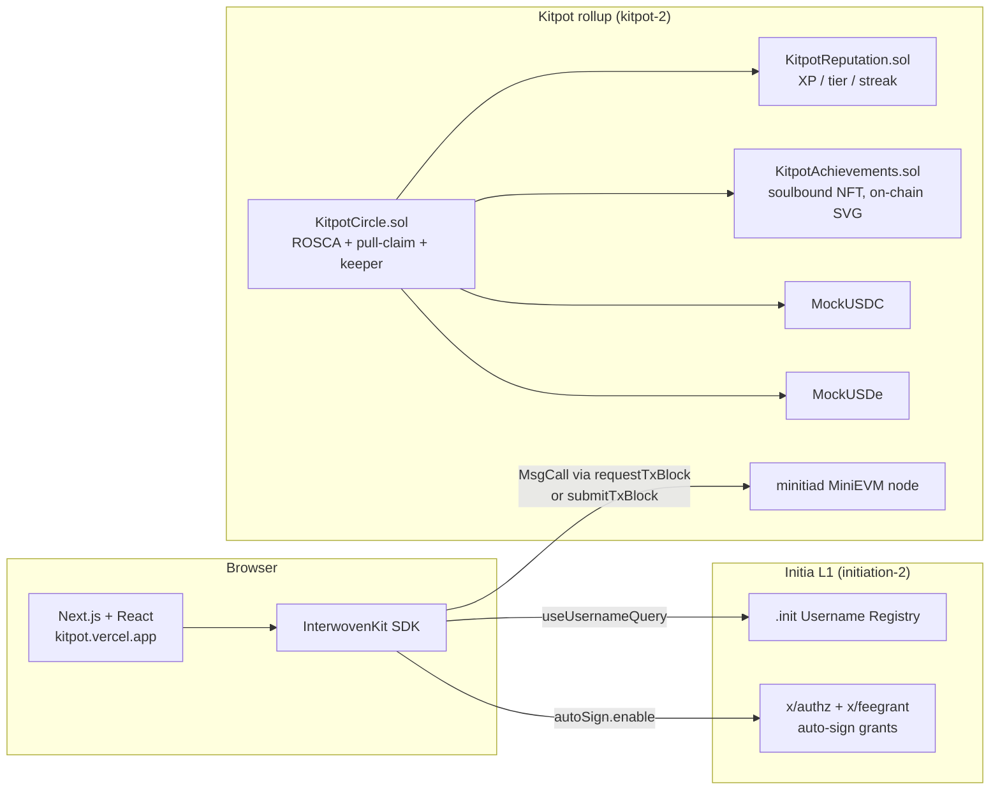

# Kitpot — Trustless Savings Circles on Initia

> The 500-year-old social savings ritual, on-chain, with the treasurer replaced by a smart contract.

| | |
|---|---|
| Live demo | <https://kitpot.vercel.app> |
| Repository | <https://github.com/viandwi24/kitpot> |
| Demo video | _to be added before submit_ |
| Track | Gaming & Consumer |
| Rollup chain ID | `kitpot-2` (EVM 64146729809684) |

## Overview

Kitpot is a trustless rotating savings circle (ROSCA / arisan / chit fund) built on its own Initia EVM rollup. Friends pool a fixed contribution every cycle; the smart contract picks one member each round to receive the entire pot, then advances to the next member, until everyone has been paid exactly once.

It removes the centuries-old single-point-of-trust failure of traditional ROSCAs — the treasurer who could disappear with everyone's money — by making both the deposit collection and the pot distribution executable on-chain code, while keeping the UX feel of "tap pay → done" through Initia's native auto-signing.

## Problem

Rotating savings circles are how 300+ million people on the planet save money. They go by many names — **Arisan** (Indonesia), **Chit Fund** (India), **Hui** (China), **Tanda** (Mexico), **Tontine** (West Africa), **Paluwagan** (Philippines), **Susu** (Caribbean), **Cundina** (Latin America) — but the shape is identical: a closed group commits to contribute the same amount each cycle, and one member at a time receives the total pot.

The failure mode is also identical everywhere:

- **Someone has to hold the money** between contributions and payouts. That someone can disappear with the pot, miscount, play favorites, or just stop responding to messages.
- **Late payments break trust** — and in real life, the only enforcement mechanism is shouting in the WhatsApp group.
- **Recordkeeping is brittle** — a missed cycle, a forgotten transfer, a side-deal between friends — and the social contract starts to crack.

Rotating savings circles run on social trust, and social trust scales badly past your immediate friend group.

## Solution — Meet Kitpot

Kitpot is a rotating savings circle where the treasurer is a smart contract.

### Core mechanism

- Every member deposits the same contribution into the contract each cycle.
- The contract picks the recipient based on round-robin order (deterministic — everyone gets the pot exactly once).
- When the cycle window elapses, the recipient calls `claimPot()` to atomically pull the pot to themselves and advance the circle to the next cycle.
- If the recipient is dormant for 7 days past the cycle end, ANY wallet can call `substituteClaim()` — the pot still lands in the recipient's address, and the caller earns 0.1% as a keeper fee for unsticking the circle.
- Collateral the user posts on join is held by the contract; missed deposits get slashed automatically (5% per missed cycle), so the late-payment problem is enforced atomically instead of socially.

### Key design principles

- **Token-agnostic** — circles can use USDC, USDe, or any future bridged stable. Multi-asset by design, not single-token.
- **Predictable timing** — every cycle's deadline is calculated as `previousStart + cycleDuration`. A late claim never extends the next cycle.
- **No bot dependency** — pull-claim model means recipients are economically incentivized to claim themselves; the permissionless keeper fallback eliminates the "stuck circle" failure mode without requiring infrastructure to babysit.

### What makes Kitpot different

- **First trustless ROSCA on Initia.** Same product surface as off-chain arisan; replaces the treasurer with code rather than rebuilding the social contract.
- **Native Initia integration at depth.** All three INITIATE-recognised native features (auto-sign, `.init` usernames, Interwoven Bridge) integrated meaningfully — see below.
- **Honest scope on auto-sign.** Auto-sign is session-based: enable once per session, and per-cycle deposits sign silently while the tab is open. We do **not** claim "background auto-pay while you sleep" — that's a server-side bot problem we treat as a real product step on the roadmap, not a hackathon hack.

## How it works (90 seconds)

1. **Create** — Anyone creates a circle. Pick token (USDC / USDe / any ERC20), contribution amount, member count (3–20), cycle duration (60 s for demo, days/weeks/months in production), grace period, late penalty %, public/private, optional minimum trust tier.
2. **Join** — Other members open the share link `/join/<id>` and deposit 1× contribution as collateral. When the last seat fills, the circle status flips Forming → Active and cycle 0 starts.
3. **Auto-sign** — Each member enables auto-sign once (single header click, one Privy/Brave popup to sign the authz + feegrant message). From that moment on, deposits + claims this session sign silently.
4. **Deposit** — Within each cycle window, every member calls `deposit()`. Late deposits past grace period: 5% of contribution slashed from collateral.
5. **Claim** — Once the cycle elapses, the recipient calls `claimPot()`, which atomically slashes collateral of any non-payer, transfers (totalPot − 1% platform fee) to the recipient, and advances the circle to the next cycle.
6. **Keeper safety net** — If the recipient is dormant for 7 more days, `substituteClaim()` unlocks for the public. Pot still lands at the recipient's wallet; the keeper earns 0.1% for unsticking.
7. **Complete** — When every member has been the recipient once, status → Completed. Each member calls `claimCollateral()` to get their initial deposit back (minus any late-payment slashes).

## Architecture

## Native Initia integration (meaningful, not surface-level)

| Feature | How we use it | Honest scope |
|---|---|---|
| **Auto-signing** (`autoSign.enable`, `submitTxBlock`) | Session ghost wallet + Cosmos `x/authz` + `x/feegrant`. Per-cycle deposits sign silently for the duration of the user's tab. | Session-based, **not** a server bot. Closing the tab ends the session. |
| **`.init` usernames** (`useUsernameQuery`) | All identity in the UI (turn order, payment status, leaderboard, profile) resolves through Initia L1 username registry. | If wallet has no `.init` registered, we fall back honestly to truncated address. **No fake** username strings. |
| **Interwoven Bridge** (`openDeposit`, `openWithdraw`) | Bidirectional bridge UI on the Faucet page, pre-filled with `initiation-2` ↔ `kitpot-2` for native `uinit`. | Modal currently shows "no available assets" because `kitpot-2` is not yet in the public chain registry. We document this in-product per official Initia docs guidance. Bridge logic is live; activating end-to-end transport is a roadmap item (OPinit bots + registry PR). |

## Target users

The first wedge is **diaspora communities and tight-knit workplace / religious / cultural groups** that already organize arisan over WhatsApp. They have the social fabric to enforce participation but bleed pots regularly to disappearing treasurers. Kitpot keeps their existing ritual intact and removes the single point of trust failure.

Second wedge: **Web3-native users in emerging markets** who want a forced-savings tool that isn't yield speculation, doesn't require KYC, and gives them on-chain reputation they can carry to other dapps.

## Business model

| Stream | Mechanism | Status |
|---|---|---|
| Platform fee | 1% of every pot, kept in `accumulatedFees[token]`, owner-withdrawable | Live (configurable up to 5%) |
| Late-payment penalty | 5% of contribution slashed from collateral on missed cycles | Live (configurable per circle) |
| Keeper fee | 0.1% of pot to whoever calls `substituteClaim` after 7-day dormant grace | Live |
| Premium circles (planned) | Higher contribution caps, custom branding, off-chain reminders, higher trust-tier gating | Roadmap |
| Reputation-as-a-service (planned) | Other Initia dapps query `KitpotReputation` to gate access to higher-risk loans, NFT mints, governance | Roadmap |

The fee model is symmetric to traditional ROSCA management fees (5–10% in many countries). At 1% we sit well below that — sustainable but not extractive.

## Market opportunity

- **300M+** people globally participate in rotating savings circles (World Bank Findex).
- **$50B+/year** of informal savings flows through arisan/chit funds in Indonesia alone (central bank estimate).
- The product fits markets where banking penetration is uneven, trust networks are tight, and the social punishment for breaking ROSCAs is high — meaning user retention curves on a digital ROSCA can resemble messaging apps more than savings apps.
- **First mover** on Initia: no other ROSCA primitive deployed on the Initia ecosystem yet.

## Why now

- Initia mainnet is approaching; early protocols on a new ecosystem capture the most distribution.
- Mobile-first social-login wallets (Privy + InterwovenKit) finally make on-chain savings accessible to non-crypto-native users — exactly the demographic that runs offline ROSCAs today.
- Auto-signing as an Initia primitive removes the "approve every transaction" friction that has historically killed every recurring-payment dapp.

## Competitive landscape

| | Offline ROSCAs (today) | Generic stablecoin transfer | **Kitpot** |
|---|---|---|---|
| Trustless treasurer | ❌ human treasurer | n/a (no rotation) | ✅ smart contract |
| Late-payment enforcement | ⚠️ social pressure only | n/a | ✅ on-chain collateral slash |
| Predictable cycle deadlines | ⚠️ depends on the treasurer | n/a | ✅ deterministic on-chain |
| Multi-currency support | ⚠️ one local currency per circle | ✅ any token | ✅ any ERC20 (USDC + USDe shipped) |
| Initia-native auto-sign | ❌ | ❌ | ✅ session-based silent deposits |
| Initia `.init` username display | ❌ | ❌ | ✅ real L1 registry only |
| Interwoven Bridge UI | ❌ | ❌ | ✅ bidirectional Deposit + Withdraw |
| Pull-claim + permissionless keeper | ❌ pot can stall when treasurer disappears | n/a | ✅ recipient claims, fallback after 7 days |
| Soulbound reputation NFT | ❌ | ❌ | ✅ on-chain SVG badges |
| Own Initia rollup (`kitpot-2`) | ❌ | ❌ | ✅ via `minitiad` |

To our knowledge, **Kitpot is the first on-chain rotating-savings-circle primitive on Initia**. The closest analogues are off-chain group savings apps with manual treasurers (the millions of WhatsApp group ROSCAs that already exist) and generic crypto wallets that can theoretically do peer-to-peer transfers but offer no rotation, no enforcement, no reputation, and no shared user experience around the cycle ritual. We do not see a direct on-chain competitor in the Initia ecosystem at submission time.

## Vision & roadmap

Post-hackathon priorities:

1. **Telegram mini-app + notifications** — a Grammy-based bot that nudges users when it's their turn to claim, when a deposit is due, or when a slash is about to happen. Lifts the pull-claim model from "user must check the dashboard" to "user gets nudged on the channel they actually live on".
2. **Bridge transport live** — enable OPinit executor + challenger + IBC relayer on our public deployment and submit a registry PR for `kitpot-2`, so Bridge actually carries `uinit` between L1 and the rollup.
3. **Server-side authz bot for offline auto-pay** — optional second auto-sign mode where users grant a Kitpot bot wallet `MsgExec` permission scoped to a single circle's deposit calls. Pays cycles even when the user is offline. Custody and key rotation become real concerns; we treat this as a proper product step, not a hack.
4. **Real bridged stables (Noble USDC, sUSDe, etc.)** — drop MockUSDC / MockUSDe in favor of real bridged-in stables. Contract is already token-agnostic.
5. **Reputation-as-a-service SDK** — let other Initia dapps gate features by Kitpot trust tier.
6. **Mainnet launch with first community partner** — pilot with one diaspora group already running offline arisan.

Guaranteed savings. Honest UX. Built for Initia.

---

**Full technical depth, deployed contract addresses, and step-by-step run instructions:** see [README.md in the repo](https://github.com/viandwi24/kitpot/blob/main/README.md).
